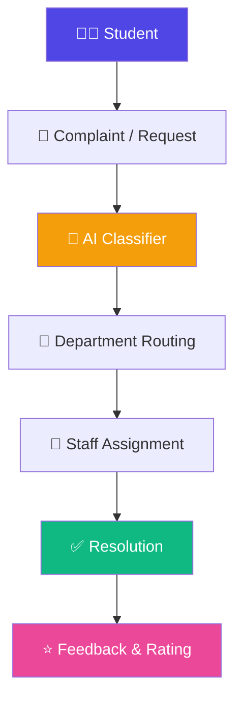
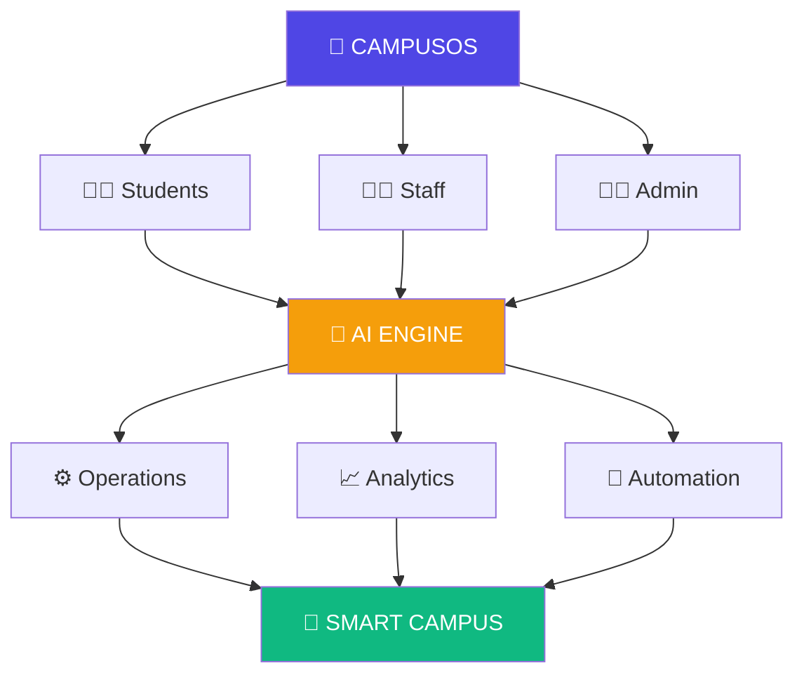
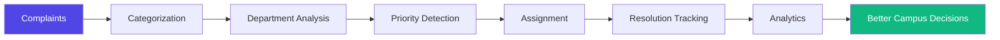
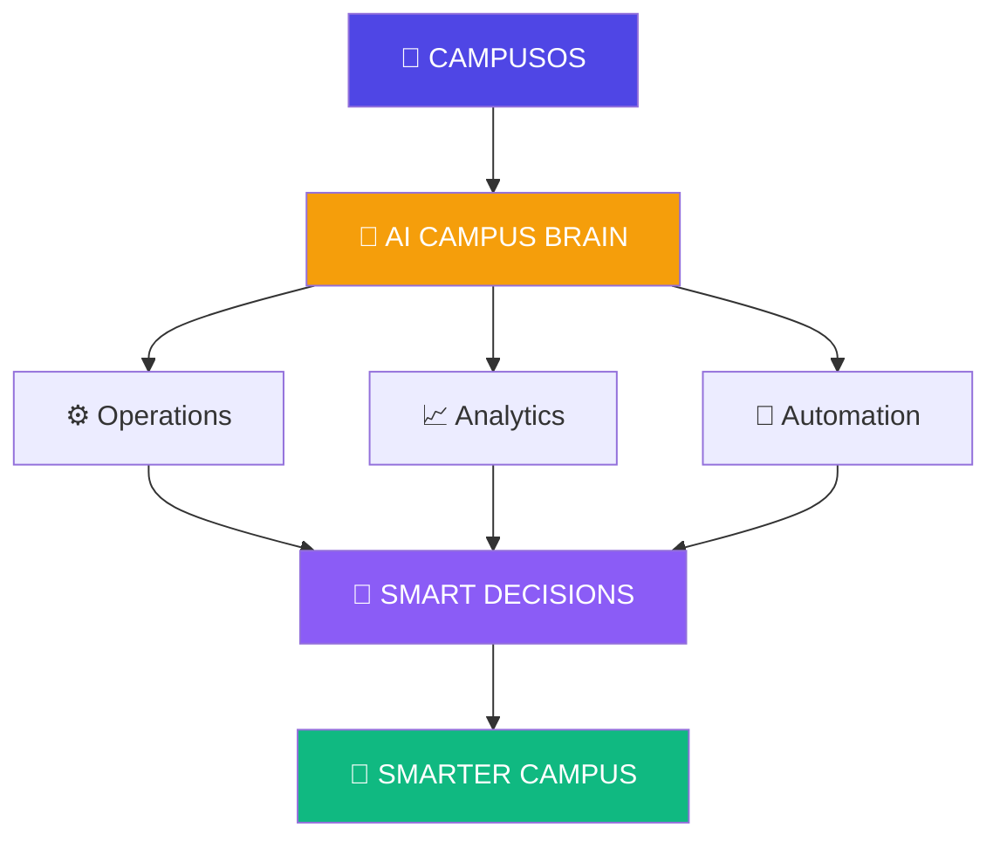

<<<<<<< HEAD
# CampusOS

CampusOS is an AI-powered college operations platform. It includes a FastAPI/PostgreSQL backend and a Next.js operations portal.

## Run with Docker

1. Copy `.env.example` to `.env` and replace `JWT_SECRET_KEY`.
2. Run `docker compose up --build` from this directory.
3. Open API documentation at `http://localhost:8000/docs`; service health is at `http://localhost:8000/api/v1/health`.

## Local backend

```bash
cd backend
cp .env.example .env
python3.11 -m venv .venv
source .venv/bin/activate
pip install -r requirements.txt
=======
<div align="center">

# 🏫 CampusOS

### AI-Powered College Operations & Student Support Platform

<p>
  
  
  
</p>

<p>
  
  
  
  
  
  
  
  
</p>

**One Campus. One Platform. Smarter Operations. Better Student Experience.**

[Overview](#-overview) •
[Features](#-features) •
[Workflow](#-complaint-workflow) •
[Tech Stack](#️-technology-stack) •
[Quick Start](#-quick-start) •
[API](#-api-reference) •
[Roadmap](#️-roadmap) •
[Contributing](#-contributing)

</div>

---

## 🧭 Overview

CampusOS is a modern **AI-powered college operations platform** that connects **students, faculty, staff, departments, and administrators** through one unified digital ecosystem.

Instead of scattered complaints, manual follow-ups, disconnected departments, and paperwork, CampusOS creates a structured digital workflow:

<div align="center">

### `Student` → `Request/Complaint` → `AI Classification` → `Department` → `Staff` → `Resolution` → `Feedback`

</div>

---

## ✨ Features

<table>
<tr>
<td width="50%" valign="top">

### 👨‍🎓 Student Portal

- 📝 Raise complaints and requests
- 📸 Upload images and supporting files
- 📍 Track complaint status in real time
- 💬 Add comments and chat with staff
- 🔔 Receive instant notifications
- 🔎 Access Lost & Found management
- 📢 View campus announcements
- ⭐ Submit feedback after resolution

</td>
<td width="50%" valign="top">

### 👨‍💼 Admin Dashboard

- 📊 Campus-wide analytics
- 🏢 Department management
- 👥 Staff management
- 🎯 Complaint assignment
- 🚨 Priority issue monitoring
- 📈 Resolution statistics
- 🔔 Notification management
- 🧾 Full audit trail per complaint

</td>
</tr>
</table>

### 🤖 AI-Powered Operations

CampusOS intelligently processes campus requests and auto-determines:

| Attribute | Description |
|---|---|
| 🏷️ **Category** | What type of issue is this? |
| 🏢 **Department** | Which team should handle it? |
| 🚦 **Priority** | How urgent is it? |
| 🎯 **Assignment** | Who's the best-fit staff member? |
| 📊 **Trends** | What patterns is the campus seeing? |

**Example in action:**

> 💬 *"The AC in Room 204 is not working."*

```yaml
Category:   Maintenance
Department: Facilities
Priority:   Medium
Status:     Submitted
```

---

## 🚀 Complaint Workflow



---

## 🧩 CampusOS Ecosystem



---

## 🛠️ Technology Stack

<table>
<tr>
<th>Frontend</th>
<th>Backend</th>
<th>Infrastructure</th>
</tr>
<tr>
<td valign="top">

⚛️ React
▲ Next.js
🔷 TypeScript
🎨 Tailwind CSS
🧩 Radix UI

</td>
<td valign="top">

🐍 Python
⚡ FastAPI
🗄️ PostgreSQL
🔧 SQLAlchemy
📦 Alembic
🔐 JWT Auth
🔑 bcrypt

</td>
<td valign="top">

🐳 Docker
🐙 Docker Compose
🗄️ PostgreSQL

</td>
</tr>
</table>

---

## 🏗️ Project Structure

```text
CampusOS/
│
├── backend/
│   ├── app/
│   │   ├── api/
│   │   ├── models/
│   │   ├── schemas/
│   │   ├── services/
│   │   └── main.py
│   ├── alembic/
│   ├── seed.py
│   ├── requirements.txt
│   └── alembic.ini
│
├── frontend/
│   ├── app/
│   ├── components/
│   ├── public/
│   ├── services/
│   └── package.json
│
├── docker-compose.yml
├── README.md
└── .gitignore
```

---

## ⚡ Quick Start

### 🐳 Docker (Recommended)

```bash
git clone https://github.com/shaurya713/CampusOS.git
cd CampusOS
cp .env.example .env
docker compose up --build
```

<table>
<tr>
<td>🌐 <b>API</b></td>
<td><code>http://localhost:8000</code></td>
</tr>
<tr>
<td>📚 <b>Interactive Docs</b></td>
<td><code>http://localhost:8000/docs</code></td>
</tr>
<tr>
<td>❤️ <b>Health Check</b></td>
<td><code>http://localhost:8000/api/v1/health</code></td>
</tr>
</table>

### 🐍 Local Backend Setup

```bash
cd backend
python3.11 -m venv .venv
source .venv/bin/activate
pip install -r requirements.txt
cp .env.example .env
>>>>>>> 1b8878ef404f483e7609ab1c87da6c2e8c648546
alembic upgrade head
uvicorn app.main:app --reload
```

<<<<<<< HEAD
Then seed local data:
=======
### 🌱 Seed Development Data
>>>>>>> 1b8878ef404f483e7609ab1c87da6c2e8c648546

```bash
python seed.py
```

<<<<<<< HEAD
Development credentials: `admin@campus.edu` / `CampusOS123`.

## Implemented endpoints

- `GET /api/v1/health`
- `POST /api/v1/auth/register`
- `POST /api/v1/auth/login`
- `POST /api/v1/auth/refresh`
- `POST /api/v1/auth/logout`
- `GET /api/v1/auth/me`
- Departments, categories, staff, complaints, comments, status/assignment, notifications, uploads, Lost & Found, announcements, and admin analytics are documented at `/docs`.
=======
### 🔐 Development Login

```text
Email:    admin@campus.edu
Password: CampusOS123
```

> ⚠️ **These credentials are for local development only.**

---

## 🔌 API Reference

<details>
<summary><b>🔑 Authentication</b></summary>

```http
POST /api/v1/auth/register
POST /api/v1/auth/login
POST /api/v1/auth/refresh
POST /api/v1/auth/logout
GET  /api/v1/auth/me
```

</details>

<details>
<summary><b>❤️ Health</b></summary>

```http
GET /api/v1/health
```

</details>

<details>
<summary><b>🏫 Campus Modules</b></summary>

```text
🏢 Departments
🏷️ Categories
👥 Staff
📝 Complaints
💬 Comments
🔄 Status & Assignment
🔔 Notifications
📎 Uploads
🔎 Lost & Found
📢 Announcements
📊 Admin Analytics
```

</details>

📖 Complete API documentation is available via Swagger UI at:
**`http://localhost:8000/docs`**

---

## 📊 Operational Intelligence

CampusOS transforms raw campus complaints into useful operational insights:



Administrators can use this to identify:

- 🔁 Frequently reported problems
- 🏢 High-load departments
- ⏳ Resolution bottlenecks
- 🏗️ Recurring infrastructure issues
- 👥 Staff workload
- 📈 Campus-wide trends

---

## 🔔 Notification System

Users receive notifications for:

| Event | Icon |
|---|:---:|
| Complaint creation | 📝 |
| Complaint assignment | 🎯 |
| Status updates | 🔄 |
| Staff comments | 💬 |
| Complaint resolution | ✅ |
| Announcements | 📢 |
| Important campus alerts | 🚨 |

---

## 🔎 Lost & Found

A dedicated module to help reunite people with their belongings.

<table>
<tr>
<td valign="top">

**📦 Lost Item**
- Item
- Description
- Location
- Date
- Image
- Contact Info

</td>
<td valign="top">

**✅ Found Item**
- Item
- Description
- Location
- Date
- Image
- Contact Info

</td>
</tr>
</table>

Students and staff can report found belongings and help return them to their owners. 🤝

---

## 📢 Campus Announcements

Administrators can publish:

- 🚨 Emergency alerts
- 📚 Academic notices
- 🎓 Events
- 🔧 Maintenance alerts
- 📅 Important deadlines

---

## 🗺️ Roadmap

<details open>
<summary><b>✅ Phase 1 — Core Platform</b></summary>

- [x] Authentication
- [x] PostgreSQL Integration
- [x] Complaints
- [x] Departments
- [x] Staff
- [x] Notifications
- [x] Lost & Found
- [x] Announcements
- [x] Admin Analytics

</details>

<details>
<summary><b>🤖 Phase 2 — AI Campus</b></summary>

- [ ] AI Complaint Classification
- [ ] Automatic Department Assignment
- [ ] Priority Prediction
- [ ] AI Campus Chatbot
- [ ] Duplicate Complaint Detection
- [ ] Smart Recommendations

</details>

<details>
<summary><b>⚡ Phase 3 — Real-Time Campus</b></summary>

- [ ] WebSocket Notifications
- [ ] Live Complaint Tracking
- [ ] Real-Time Staff Chat
- [ ] Live Campus Alerts

</details>

<details>
<summary><b>🧠 Phase 4 — Advanced Intelligence</b></summary>

- [ ] Predictive Maintenance
- [ ] Complaint Heatmaps
- [ ] Department Performance Analytics
- [ ] AI-Generated Reports
- [ ] Campus Trend Forecasting

</details>

---

## 🔐 Security

CampusOS follows modern backend security practices, including:

- 🔑 JWT-based authentication
- 🔒 Password hashing with bcrypt
- 🛡️ Role-based access control
- 🌍 Environment-based secrets
- 🗄️ PostgreSQL database security
- 🚧 Protected API endpoints
- 📎 File upload validation

> ⚠️ **Never commit real `.env` files, passwords, API keys, or production secrets to GitHub.**

---

## 🎯 Vision

CampusOS is more than a complaint-management system — it's the foundation of a complete **AI-powered Campus Operating System.**



> 💡 **Every request is tracked.**
> 🏢 **Every department is connected.**
> 👤 **Every issue has an owner.**
> 📊 **Every decision is backed by data.**

---

## 🤝 Contributing

Contributions, ideas, and improvements are always welcome!

```bash
git clone https://github.com/shaurya713/CampusOS.git
cd CampusOS
git checkout -b feature/your-feature
```

Make your changes, commit them, and open a **Pull Request**. 🚀

---

## 👨‍💻 Author

<div align="center">

### **Shauryavardhan Singh**

*Computer Science & Engineering | AI & Data Science*

[](https://github.com/shaurya713)

</div>

---

## ⭐ Support CampusOS

<div align="center">

If you find CampusOS useful or interesting:

**⭐ Star the repository&nbsp;&nbsp;•&nbsp;&nbsp;🍴 Fork the project&nbsp;&nbsp;•&nbsp;&nbsp;💡 Share ideas&nbsp;&nbsp;•&nbsp;&nbsp;🤝 Contribute**

<br>

**Made with ❤️ for smarter campuses**

</div>
>>>>>>> 1b8878ef404f483e7609ab1c87da6c2e8c648546
